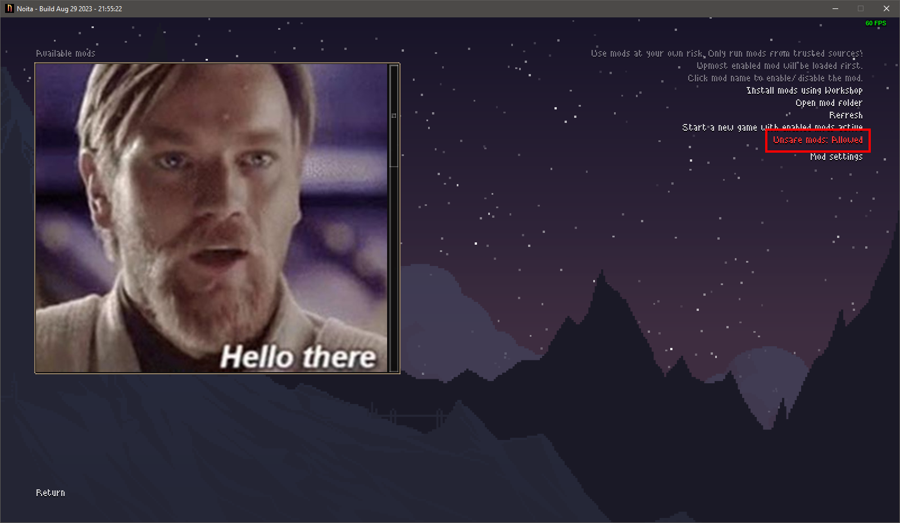

# 10 bullet points to debug Noita

1. Install [Noita](https://noitagame.com/) from [Steam](https://store.steampowered.com/app/881100/Noita/)
2. Install [lldebugger](https://marketplace.visualstudio.com/items?itemName=tomblind.local-lua-debugger-vscode) as VSCode extension and make sure to let some love to the author by giving a star to the [project](https://github.com/tomblind/local-lua-debugger-vscode).
3. Download [noita-vscode-debugger](https://github.com/Ismoh/noita-vscode-debugger/releases) mod and\
    go to `C:\Program Files (x86)\Steam\steamapps\common\Noita\mods\` and extract it there. [need help?](https://noita.wiki.gg/wiki/How_to_install_mods#Manual)
4. Open your current own project in VSCode and add the following to your `launch.json` file:
    
    https://github.com/Ismoh/noita-vscode-debugger/blob/develop/.vscode/launch.json#L1-L22

5. Double check if `"cwd"` needs to be changed to Noita installation path. [need help?](https://help.steampowered.com/en/faqs/view/4BD4-4528-6B2E-8327#:~:text=Navigate%20to%20your%20Steam%20client,installations%20can%20be%20installed%20there.)
6. Press `F5` to start debugging.
7. Make sure `noita-vscode-debugger` mod is enabled in the mod list
8. Enable unsafe mode in Noita\
    [need help?](https://noita.wiki.gg/wiki/How_to_install_mods#Enabling) and [still no clue?](https://noita.wiki.gg/wiki/Modding:_Lua_API#Lua_Tables)
    
9. Click on `Start a new game with enabled mods active`\
    or click on `Continue` if you already have a save file with the mod enabled\
    or finally click on `New Game`.
10. Enjoy debugging!

Need help with the debugger itself? [Go ahead!](https://github.com/tomblind/local-lua-debugger-vscode)
